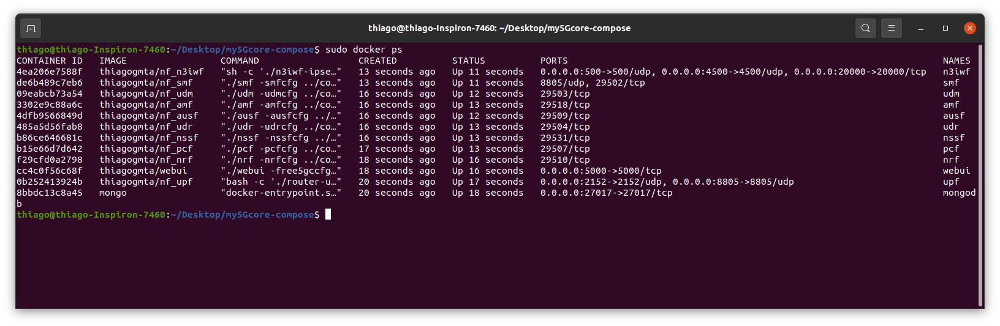

# My5GCore-k8s

O objetivo desse repositório é realizar uma orquestração das funções do núcleo do 5G através do Kubernetes. **Este projeto está em andamento**.

A base para esse repositório consiste no my5gCore-compose que por sua vez é um fork do [Free5gC Compose](https://github.com/free5gc/free5gc-compose). O my5gCore-Compose consiste no núcleo do 5G onde cada função opera em um container. Esses containers são automatizados via compose.

O manifesto (my5gc-k8s.yaml) foi criado através do kompose baseando-se no arquivo docker-compose.yaml. O arquivo, produto deste comando tem sido corrigido e melhorado para que opere de forma apropriada. Comando para criação do manifesto:

```bash
$ kompose convert -o my5gc-k8s.yaml --volumes hostPath
```

Os arquivos deste repositório consistem em:

1. docker-compose.yaml

   1. Arquivo responsável por executar o núcleo do 5G via compose.

2. my5gc-k8s.yaml

   1. Manifesto do Kubernetes onde residem os deployments e services para o núcleo do 5G.

3. k8s.sh

   1. Script shell para finalizar todos os deployments, services e pods

   2. para executa-lo basta:

   3. ```bash
      $ ./sk8.sh
      ```

## Prerequisitos

Certifique-se de estar utilizando o kernel 5.0.0-23-generic ou superior. Você pode verificar com:

```bash
$ uname -r
```

### 1. GTP5G Kernel Module

Por conta das exigências do UPF faz-se necessário a instalação do gtp5g:

```bash
$ git clone https://github.com/PrinzOwO/gtp5g.git
$ cd gtp5g
$ make
$ sudo make install
```

### 2. Docker

Instalação de pacotes pré-requisitos

```bash
$ sudo apt install apt-transport-https ca-certificates curl software-properties-common
```

Adição da chave para o repositório oficial

```bash
$ curl -fsSL https://download.docker.com/linux/ubuntu/gpg | sudo apt-key add -
```

Adição do repositório Docker

```bash
$ sudo add-apt-repository "deb [arch=amd64] https://download.docker.com/linux/ubuntu focal stable"
```

Atualização do bando de pacotes

```bash
$ sudo apt update
```

Instalação do Docker

```bash
$ sudo apt install docker-ce
```

Para verificar o status

```
$ sudo systemctl status docker
```

### 3. Docker Compose

O docker compose permite gerir a inicialização e finalização de diversos containers simultaneamente. Seu funcionamento se dá através de arquivos YAML que guardam as definições dos containers.

Baixando a release `1.28.2` do binário de instalação e salvar em `/usr/local/bin/docker-compose`, que tornará este software globalmente acessível como `docker-compose`.

```bash
$ sudo curl -L "https://github.com/docker/compose/releases/download/1.28.2/docker-compose-$(uname -s)-$(uname -m)" -o /usr/local/bin/docker-compose
```

Definição das permissões para execução

```bash
$ sudo chmod +x /usr/local/bin/docker-compose
```

Para verificar se tudo ocorreu bem execute

```bash
$ docker-compose --version
```

## 1. Executando o my5gc via docker-compose

Como precisamos criar uma interface de tunel, necessitamos criar um containger com permissões de root.

Dowload dos arquivos do núcleo:

```bash
$ git clone https://github.com/thiagogmta/my5gc-k8s.git
```

Executando os containers através do docker-compose

```bash
$ cd my5gc-k8s
$ sudo docker-compose up 
```

ou

```bash
$ sudo docker-compose up -d # Para execução em segundo plano
```

Para verificar os containers em execução:

```bash
$ sudo docker ps
```



Figura 1: Funções do My5GCore

Para finalizar:

```bash
$ sudo docker-compose down
```

## 2. Executando o My5GCore com o kubernetes

```bash
$ kubectl create -f my5gc-k8s.yaml
```

