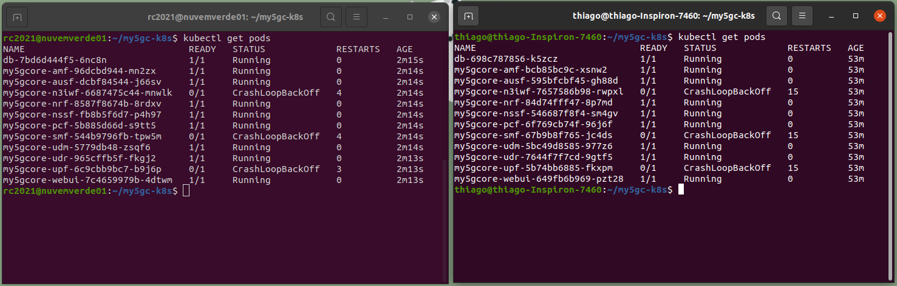

# My5GCore-k8s

O objetivo desse repositório é realizar uma orquestração das funções do núcleo do 5G através do Kubernetes. **Este projeto está em andamento**.

A base para esse repositório consiste no my5gCore-compose que por sua vez é um fork do [Free5gC Compose](https://github.com/free5gc/free5gc-compose). O my5gCore-Compose consiste no núcleo do 5G onde cada função opera em um container. Esses containers são automatizados via compose.

O manifesto (my5gc-k8s.yaml) foi criado através do kompose baseando-se no arquivo docker-compose.yaml. O arquivo, produto deste comando tem sido corrigido e melhorado para que opere de forma apropriada. Comando para criação do manifesto:

```bash
$ kompose convert -o my5gc-k8s.yaml --volumes hostPath
```

Os arquivos deste repositório consistem em:

1. docker-compose.yaml

   1. Arquivo responsável por executar o núcleo do 5G via compose.

2. my5gc-k8s.yaml

   1. Manifesto do Kubernetes onde residem os deployments e services para o núcleo do 5G.

3. k8s.sh

   1. Script shell para finalizar todos os deployments, services, pods e networkpolices

   2. para executa-lo basta:

   3. ```bash
      $ ./sk8.sh
      ```

## Prerequisitos

Certifique-se de estar utilizando o kernel 5.0.0-23-generic ou superior. Você pode verificar com:

```bash
$ uname -r
```

### 1. GTP5G Kernel Module

Por conta das exigências do UPF faz-se necessário a instalação do gtp5g:

```bash
$ git clone https://github.com/PrinzOwO/gtp5g.git
$ cd gtp5g
$ make
$ sudo make install
```

### 2. Docker

Instalação de pacotes pré-requisitos

```bash
$ sudo apt install apt-transport-https ca-certificates curl software-properties-common
```

Adição da chave para o repositório oficial

```bash
$ curl -fsSL https://download.docker.com/linux/ubuntu/gpg | sudo apt-key add -
```

Adição do repositório Docker

```bash
$ sudo add-apt-repository "deb [arch=amd64] https://download.docker.com/linux/ubuntu focal stable"
```

Atualização do bando de pacotes

```bash
$ sudo apt update
```

Instalação do Docker

```bash
$ sudo apt install docker-ce
```

Para verificar o status

```
$ sudo systemctl status docker
```

### 3. Docker Compose

O docker compose permite gerir a inicialização e finalização de diversos containers simultaneamente. Seu funcionamento se dá através de arquivos YAML que guardam as definições dos containers.

Baixando a release `1.28.2` do binário de instalação e salvar em `/usr/local/bin/docker-compose`, que tornará este software globalmente acessível como `docker-compose`.

```bash
$ sudo curl -L "https://github.com/docker/compose/releases/download/1.28.2/docker-compose-$(uname -s)-$(uname -m)" -o /usr/local/bin/docker-compose
```

Definição das permissões para execução

```bash
$ sudo chmod +x /usr/local/bin/docker-compose
```

Para verificar se tudo ocorreu bem execute

```bash
$ docker-compose --version
```

## 1. Executando o my5gc via docker-compose

Como precisamos criar uma interface de tunel, necessitamos criar um containger com permissões de root.

Dowload dos arquivos do núcleo:

```bash
$ git clone https://github.com/thiagogmta/my5gc-k8s.git
```

Executando os containers através do docker-compose

```bash
$ cd my5gc-k8s
$ sudo docker-compose up 
```

ou

```bash
$ sudo docker-compose up -d # Para execução em segundo plano
```

Para verificar os containers em execução:

```bash
$ sudo docker ps
```


Figura 1: Funções do My5GCore

Para finalizar:

```bash
$ sudo docker-compose down
```

## 2. Executando o My5GCore com o kubernetes

```bash
$ kubectl create -f my5gc-k8s.yaml
```

O cluster está sendo testardo em dois ambientes:

- Ambiente 1 - Cluster RNP
- Ambiente 2 - Cluster Local via Minikube

A seguir são executados três comandos para verificar os pods, deployments e services do Cluster. O terminal da esquerda mostra o retorno do Cluster da RNP e o terminal da direita é referente ao Cluster Local.

1. **Verificando os Pods**

```bash
$ kubectl get pods
```



Retorno dos Pods

2. **Verificando os Deployments**

```bash
$ kubectl get deployments
```


Retorno dos Deployments

3. **Verificando os Services**

```bash
$ kubectl get svc
```


Retorno dos Services

### Tratamento de Erros

Atualmente as funções a seguir estão apresentando erro em sua execução no cluster:

- n3iwf
- smf
- upf

A seguir o retorno do comando **describe pod** para a função **upf**.

```bash
$ kubectl describe pod my5gcore-upf-5b74bb6885-fkxpm

Name:         my5gcore-upf-5b74bb6885-fkxpm
Namespace:    default
Priority:     0
Node:         minikube/192.168.99.102
Start Time:   Fri, 23 Apr 2021 09:00:17 -0300
Labels:       app=my5gcore-upf
              io.kompose.network/5gcorenetwork=true
              io.kompose.network/lorawan=true
              pod-template-hash=5b74bb6885
Annotations:  <none>
Status:       Running
IP:           172.17.0.20
IPs:
  IP:           172.17.0.20
Controlled By:  ReplicaSet/my5gcore-upf-5b74bb6885
Containers:
  upf:
    Container ID:  docker://067b596eccfb7afb1995888ae070cc8854cc180639fd317eef7159ffa143fa21
    Image:         bsconsul/free5gc-upf:hardCfg
    Image ID:      docker-pullable://bsconsul/free5gc-upf@sha256:662232a5a001b1f47a04c1da984bb8e543e1c2f6cc8aa91588bf6e947ed7b73c
    Ports:         2152/UDP, 8805/UDP
    Host Ports:    0/UDP, 0/UDP
    Args:
      ./upfd
      ./upfcfg
      ../config/upfcfg.yaml
    State:          Waiting
      Reason:       CrashLoopBackOff
    Last State:     Terminated
      Reason:       ContainerCannotRun
      Message:      OCI runtime create failed: container_linux.go:370: starting container process caused: exec: "./upfd": stat ./upfd: no such file or directory: unknown
      Exit Code:    127
      Started:      Fri, 23 Apr 2021 09:11:14 -0300
      Finished:     Fri, 23 Apr 2021 09:11:14 -0300
    Ready:          False
    Restart Count:  7
    Environment:    <none>
    Mounts:
      /var/run/secrets/kubernetes.io/serviceaccount from default-token-9pj9g (ro)
Conditions:
  Type              Status
  Initialized       True 
  Ready             False 
  ContainersReady   False 
  PodScheduled      True 
Volumes:
  default-token-9pj9g:
    Type:        Secret (a volume populated by a Secret)
    SecretName:  default-token-9pj9g
    Optional:    false
QoS Class:       BestEffort
Node-Selectors:  <none>
Tolerations:     node.kubernetes.io/not-ready:NoExecute op=Exists for 300s
                 node.kubernetes.io/unreachable:NoExecute op=Exists for 300s
Events:
  Type     Reason     Age                 From               Message
  ----     ------     ----                ----               -------
  Normal   Scheduled  16m                 default-scheduler  Successfully assigned default/my5gcore-upf-5b74bb6885-fkxpm to minikube
  Normal   Pulled     14m (x5 over 16m)   kubelet            Container image "bsconsul/free5gc-upf:hardCfg" already present on machine
  Normal   Created    14m (x5 over 16m)   kubelet            Created container upf
  Warning  Failed     14m (x5 over 16m)   kubelet            Error: failed to start container "upf": Error response from daemon: OCI runtime create failed: container_linux.go:370: starting container process caused: exec: "./upfd": stat ./upfd: no such file or directory: unknown
  Warning  BackOff    51s (x68 over 15m)  kubelet            Back-off restarting failed container
```

Retorno do comando kubectl describe pod para a função upf